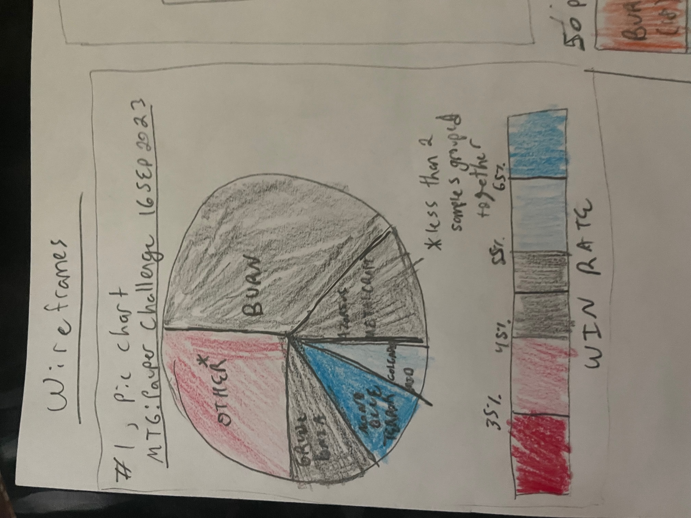
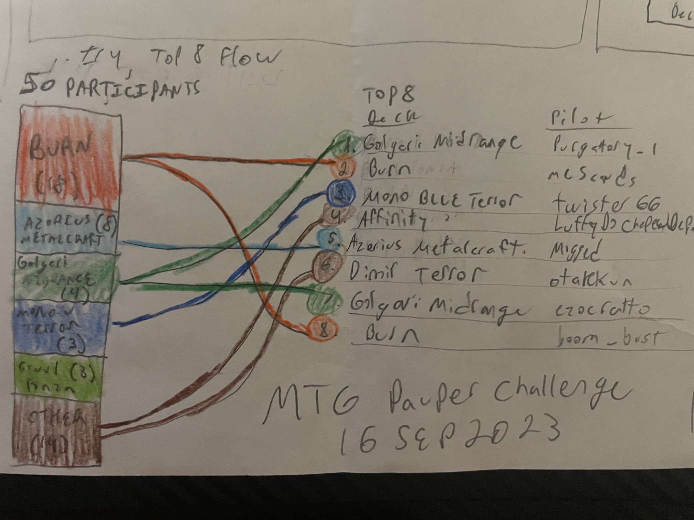

# Critique By Design - MTG Pauper Challenge Results

## Original Data Visualization

I enjoy playing the card game Magic: The Gathering (MTG) and often look at [mtggoldfish.com](https://www.mtggoldfish.com/articles/the-power-of-pauper-inside-and-out) for reports on recent tournaments. In this game players can build their own decks of cards, but generally gravitate towards a few successful strategies. This website posts weekly articles on the current 'metagame' (what decks are popular and how those decks are performing). A common series of charts is taken from performance in a weekly tournament, the Pauper Challenge. This data is collected by the Castle of Commons discord and is freely available at this [link](/https://docs.google.com/spreadsheets/d/1vMIA_qU5YCpv74hdiGgTqxmUpvY20yRIhtDBcUzxA88/edit#gid=1470099066/).  

These three charts show the most important information for a tournament: Play %, Win%, and Top 8 performers.  

## Critique

These charts are simple and effective. Additionally, they have the benefit of being a chart consistently produced in the same format so enfranchised players should be familiar with the format. Seeing as this is niche information that would not be accessible to most viewers, two target audiences should be kept in mind.
1) Heavily enfranchised players who want to keep up with the weekly tournaments.  
2) New players who want to see popular decks as they get into the game.  

My biggest issues with these charts are the following:
1) Not exciting. The color palette and form is a bit bland and uninteresting. It does not draw attention to the data or any key insights.  
2) Inefficient use of space. The current format uses three different charts and a lot of space to give very simple information.  
3) Doesn't Tell the full story. Showing number of pilots (players that played the deck) without including the number of players in the tournament is odd.  

## Wireframing Solutions

For all of these solutions, I used the most recent tournament results (16 September, 2023). Notably this is not the same tournament as highlighted in the most recent article. However, due to the consistency of the chart the success of a visualization technique should be independent of the week the data was collected.

### Attempt 1: Pie Chart

For this attempt I went against the class advice and used a pie chart. This made sense as a way to depict meta % as part of the whole. I tested a couple color pallets but ended up using a red/blue diverging scale for this one to see how it looked. I used the color to show the winrate information. This vis would benefit from tableau or a similar software that provided the popouts for more information. I wasnt thrilled with how the categories blended together here.

### Attempt 2: Colored Text Chart

My second atttempt was to do the most basic approach and just combine all the information in to one text chart. For the Win rate and top 8 performances I used a reg-green variant of the diverging color scale. I think this simple approach would work pretty well for the websites articles as it is not a huge departure from the current design. Since this chart was not super interesing to me, I wanted to try something more exciting for the final visualization.

### Attempt 3: Circle Chart

For this attempt I was inspired by Fluorish's parliament chart, where each seat is represented by its own circle. In this visualization, each circle represents one player using that deck in the tournament. I used the same red-green scale showing win percent and also used yellow circles to include information about the top 8.

### Attempt 4: Top 8 Flow

My final visualization attempt was my favorite. This shows the progression of each deck as a portion of the field on the left as a stacked bar to the top 8 on the right as a standard text list. Color here is used for categorization and I chose colors that would MTG players would associate with that deck (ie Burn is fiery orange). 

## Testing the Solution

I shared my wireframes with two other students and got the following feedback.

### Student 1: Male 26, Familiar with MTG

1) Favorite charts were the pie chart (#1) followed by the circles (#3).  
2) Disliked the use of blue-red to represent win rates, since red-green was more commonly used and easily understood.  
3) For the pie chart, noted that using color to signal a metric was unconventional and that the win rate legend should be placed prominantly above the chart.  
4) For the circle chart, liked it after looking at it for a while, but thought it was a bit too busy and showed too much. Thought hightlighting win rate or top 8 was a good idea, but both was probably too much.  
5) For chart #2, would prefer top 8 to be colored as a percentage of the entrants instead of just number of top 8s.  
6) Liked the use of color in chart #4 as it was more intuitive. In contrast on the pie chart he was confused why black was used for burn.  

### Student 2: Female 26, Unfamiliar with MTG

1) Felt like she didnt have enough context to understand the charts easily. After a brief explanation of the MTG tournament results structure, she had the following feedback:  
2) Pie charts were not pleasing to look at and the color scheme on #1 made this worse.  
3) Chart #2 was boring and did not tell a story easily, just provided the data as is.  
4) Chart #3 was very busy. The use of yellow-red-green was disliked as the yellow did not stand out.  
5) Very much liked chart #4 as it was the most clear in telling a story. The colored lines helped guide her eyes in a chronological path from beginning of tournament to top 8.  
6) For chart #4, thought including the pilot/player information was unnecessary for the story being told.  

### Reflection on Feedback

I thought it was interesting that one person really liked the pie chart while another did not. The feedback informed me that striking a balance between simple and busy would be important, but very difficult with this dataset. I appreciated the feedback on the use of color and business in some of the charts. I think chart #3 in particular could shine if some of the visual clutter was removed. Since this chart would be highly targeted at users familiar with MTG, I was naturally more interested in the first person's feedback. However, I was intrigued by how the second person was drawn to chart #4. As far as telling the overall story, even to someone unfamiliar with the subject matter, I think #4 would be a very successful visualization. Due to a combination of feeback, discussion, and not meeting my personal criteria, charts #1 and #2 were off the table for the rest of the assignment.

## Recreated Data Visualization

While I was most interested in producing a final version of wireframe #4, I had no idea how to approach this using the software we covered in class. I settled on reproducing a simpler form of wireframe #3 using Tableau. When publishing there was a consistent issue with information in the 'Golgari' portion disappearing, but this information will still display when hovered over.

<noscript></noscript><object class='tableauViz'  style='display:none;'><param name='host_url' value='https%3A%2F%2Fpublic.tableau.com%2F' /> <param name='embed_code_version' value='3' /> <param name='site_root' value='' /><param name='name' value='MTGPauperChallenge&#47;Sheet1' /><param name='tabs' value='no' /><param name='toolbar' value='yes' /><param name='static_image' value='https:&#47;&#47;public.tableau.com&#47;static&#47;images&#47;MT&#47;MTGPauperChallenge&#47;Sheet1&#47;1.png' /> <param name='animate_transition' value='yes' /><param name='display_static_image' value='yes' /><param name='display_spinner' value='yes' /><param name='display_overlay' value='yes' /><param name='display_count' value='yes' /><param name='language' value='en-US' /><param name='filter' value='publish=yes' /></object>
                

Datasource: https://docs.google.com/spreadsheets/d/1vMIA_qU5YCpv74hdiGgTqxmUpvY20yRIhtDBcUzxA88/edit#gid=1238260846

### Self-Critique and Comparisons to Original Visualization

1) Excitement: I think this chart makes use of color better and due to its interactive nature is more interesting than the original chart. I think using the area of the rectangles is also more intuitive than using a bar chart for meta % since it is depicting a fraction-of-a-whole relationship. I was not thrilled with how the red-green scale looked (somewhat bland/samey), but stuck with it due to the feedback I received and the importance of sticking to well known design conventions.  
2) Efficiency: This chart combines most of the information from three charts into one while still being pretty easy to interpret and thus met my goal of being more space efficient. The one thing this chart loses is attributing the players who actually made top 8. I think the top 8 chart as has been historically used in these articles can not be replaced since it is already very simple and provides well deserved call outs for the players who achieve these standings.  
3) Completeness: The text and popouts do most of the heavy lifting in this category. I think this chart performs slightly better than the original visualization as all the information is readily available (ie total number of players and metrics for the 'other' category) and the use of size and color is intuitive. The usage of color and area does not tell exact information, so the text remains important. I think the completeness of this chart could be improved for the other section since it is currently lumping many different decks together. I would like if the popout could highlight at least which decks in the 'other' category placed in the top 8.
