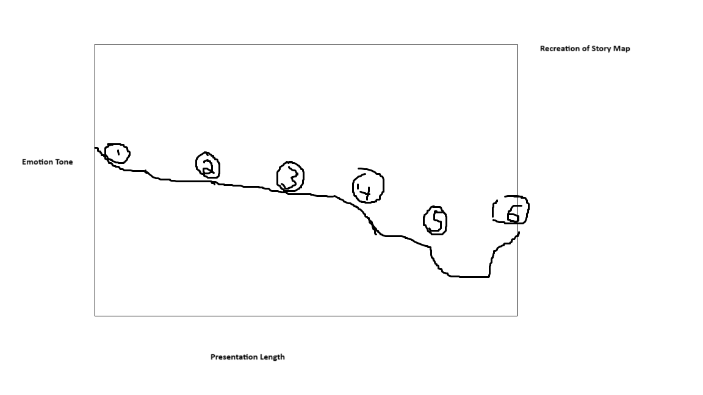
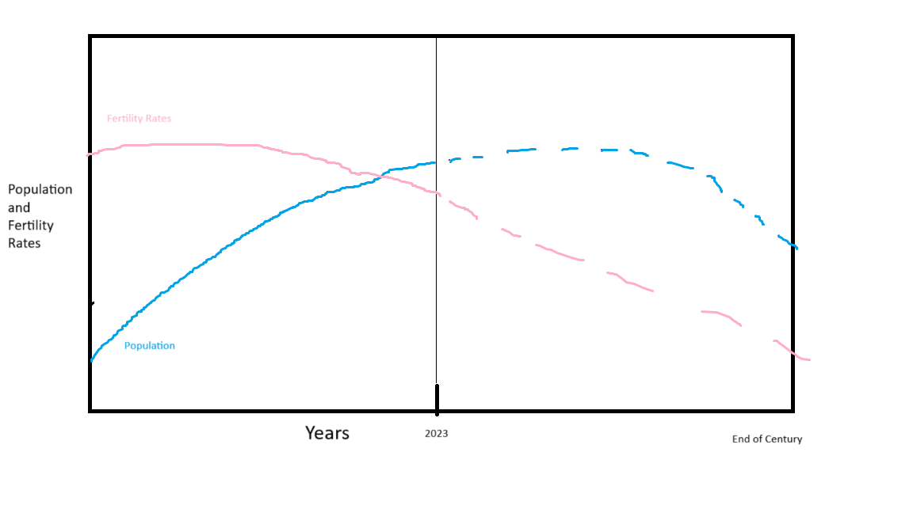
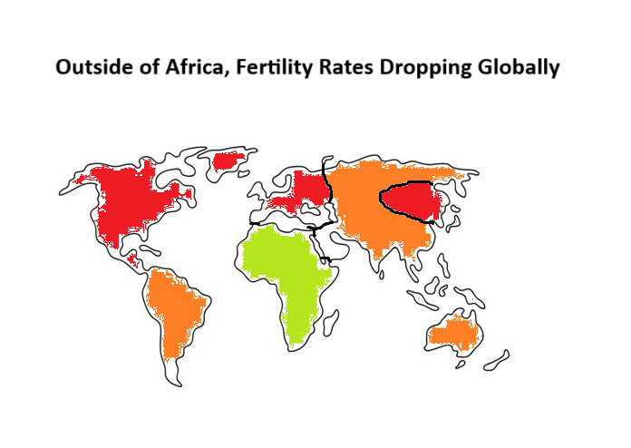
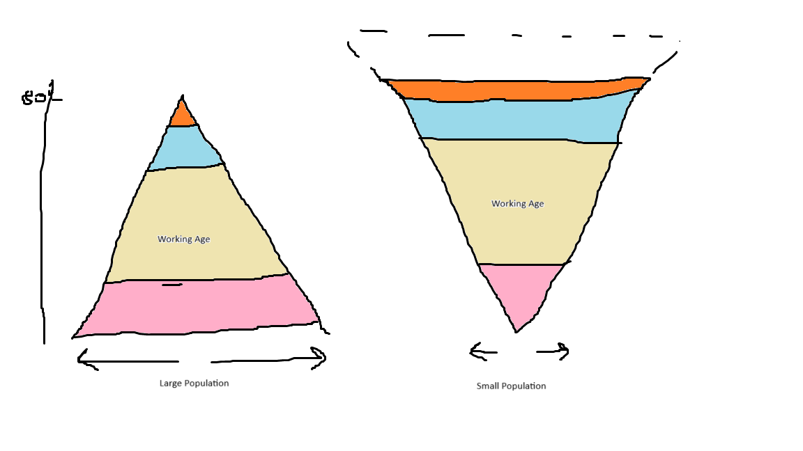
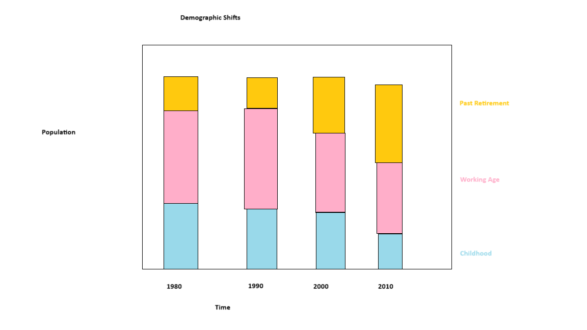

# Final Project Part1 - What a Declining Population Could Mean For You

## Outline
I am interested in showing the data that shows/predicts the declining population growth rates and eventual predicted population decline by the end of the century.
I think this data is not discussed that much because it is a far off projection, but it could cause significant changes throughout the world.

### Based on this topic there are two issues:
  1) This is broad demographic data which was suggested not to do!
Because of this I am going to try and limit the scope of my story and focus on something that could be engaging and relevent to the audience. Hence "What [it] could mean for YOU"
  2) This topic could lend itself to doomsaying or making wild projections.
My goal to avoid this is to keep everything grounded in real world data and trends, and try to minimize reliance on projections.
Additionally, I would like to contextualize the story with nuance and optimism rather than anything too dire.

Expected project flow:

(1) **Lay the Foundation.** Ill expect some in the audience to have heard this data before, but I should introduce it in a way that accepts a broad audience.
Show the world population and birthrate trends to establish that population is decreasing. Some future projection will probably be used here.

(2) **Data Breakdown** Now that we are all on the same page, lets look into the data with a bit more nuance and focus. Tease out some interesting trends and call attention to outliers or different behavior for different countries/regions.

(3) **Why is This Happening** A bit less data driven but useful to explain the connection between country development (GDP) and declining birth rates. This effect is attributed to a variety of factors so it would be another project to examine that here. One interesting idea I have heard that might be good to look at is the gap between how many children women want vs how many they have. The disparities in this gap (some +, some -) could explain this and its possible paths forward (6) could focus on lowering this gap. As of now I don't have a data source for this so it is the weakest portion of the project.

(4) **Short Term Effects** This is where I would go into the demographic shifts that my secondary sources would support well. I think just explaining the demographic shift is effective because listeners can imagine the effects of an aging population with little prodding.

(5) **Long Term Effects** Data here is minimal and relies on projection. This could also be the most doom-and-gloom portion. I plan on discussing the long term effects with nuance and an emphasis on the fact that we do not know what will happen. I dislike when presentations purport to know the future.

(6) **Potential Paths Forward** Also less data driven, but I am interested in finding some supporting data for countries that have been dealing with population decline for a while now. What are their policies and how have they worked? The resulting 'data' might be more descriptive than quantitative but Ill prefer that to pure speculation. This is the key portion to end the project on an optimistic note so I'll be looking for ways to drive that feeling.

For the inclass presentation since time will be very limited I am leaning on focusing on 1, a bit of 3, 4 and tease 6 at the end.

One Sentence Summary: Population growth is slowing and here are the likely effects.
Reader Response: As a reader I want to be ready for the effects of population decline so I am not caught off guard.
Call to Action: I can do this by maintaining awareness of local and global trends.

Story Arc:

## Sketches

Below are several intial sketches with my intent for each of them. The trends shown in these sketches is based only on prior understanding of the data as I have not analyzed it yet. I expect I will continue toying with these sketches until I find something that immediately strikes me visually. More visualizations will also be needed to cover all parts of the story.

This first sketch will be the bedrock of the story foundation as it clearly lays out the data. The projection lines can be gained from the UN data source easily.
I might include a small desciption of fertility rate units as it is childs/woman, a little unorthodox. This requires two different y axis scales so they will be on each side.

This chart utilizes the geo data we have from the source to highlight global trends and note Africa as an outlier. (part 2)

This chart is the 'inverted' pyramid model of population demographic shift I mention below. This is obviously a huge exaggeration in the current form, but is intended to show the extremes of the potential effects. It calls to mind the idea of the second pyramid collapsing under its own weight. (part 4)

This is an alternate chart that uses stacked bars to show demographic and population shifts with more nuance than the pyramid model. (part 4)

## Data
The primary data used for this project will be Population//Birth Rates by country and year(also includes demographic breakdowns)
This data is available from the [UN's Demographic Indicators](https://population.un.org/wpp/Download/Standard/MostUsed/)
This is the data that I think is most essential to tell my story and will be included prominantly.

This data source is useful because it is used for working with population trends which is what I am using it for. Because of this it contains other useful information such as migration and life expectancy data. I am particularly interested in using the migration data because one of the best ways a country can maintain economic growth through declining birth rates is through large immigration. Life expectancy data is also important because it highlights the point 
of the population demographic shift (inverted pyramid) as well as being a key element to the positive spin (we are living longer) I want to include.

Currently I am interested in two other datasets for supporting analysis.
First, the [OECD Population data](https://data.oecd.org/pop/population.htm), which allows for more granular breakdown
of age groups for OECD countries. This will not be the focus because I think looking at data for all countries is more important. Regardless using this
as a supporting graph could emphasize the demographic shifts. If I include a representation of the GDP/population correlations then GDP data is also easily available at the OECD site.
Second, [this](https://news.gallup.com/poll/394943/retiring-planning-retire-later.aspx) gallop poll includes retirement age information for the United States.
The "Get the Data" link in the bottom corner of the graphic on this page will download the relevant csv file.
I think this information would have value as supporting information because retirement is a key part of the population shift impact, even though this only shows U.S. data.

Retirement Age (US)

GDP https://data.oecd.org/gdp/gross-domestic-product-gdp.htm

## Method and Medium

I enjoyed the examples we saw on shorthand am I am excited to create my project using that source. This will be good to create the flow through the story as I imagine it.
As for the inclass presentation, I may use a smaller version of the shorthand project or have something like a video to ensure I get the points I want across in a minute.

